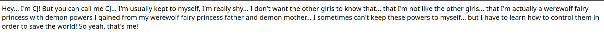

+++
title = "First blog post: Website Stuff"
date = "2025-03-21"
+++
This is the first blog post I have made here, or any where for that matter. The entire purpose of this blog was to test out how it would be to write one.

## In the beginning...
This website project started as a plain, unstyled HTML file that had a couple of changes occasionally. 

## The Head
The idea for the head came from a project I was working on (a [tiny renderer](https://github.com/CJSatnarine/tiny_renderer)), where a wireframe render inspired me to add a rotating wireframe furry wolf head to my personal website. 

To accomplish this, I created a wolf head in Blender and exported it in a Wavefront .obj format. I used [Three.js](https://threejs.org/) to render the wolf head on the website. This version of the website is where I also started using CSS. 

I should note that this was the first time I was working with JavaScript and CSS, and if it wasn't for some amazing people guiding me and answering my questions, I would have probably not made it this far. To deploy this website, I used Vite. 

## Zola
I love using markdown. I prefer it over most other markup languages, and I write most of my notes in it. When I found out I could use markdown for web dev, I started to replace my previous website design to use Zola (mostly so I can get help from a friend that uses/recommended it). This took me about a week to do, somehow. 

## What next? 
I plan on uploading more work onto here: projects, devlogs, art or animations, and more blogs.
