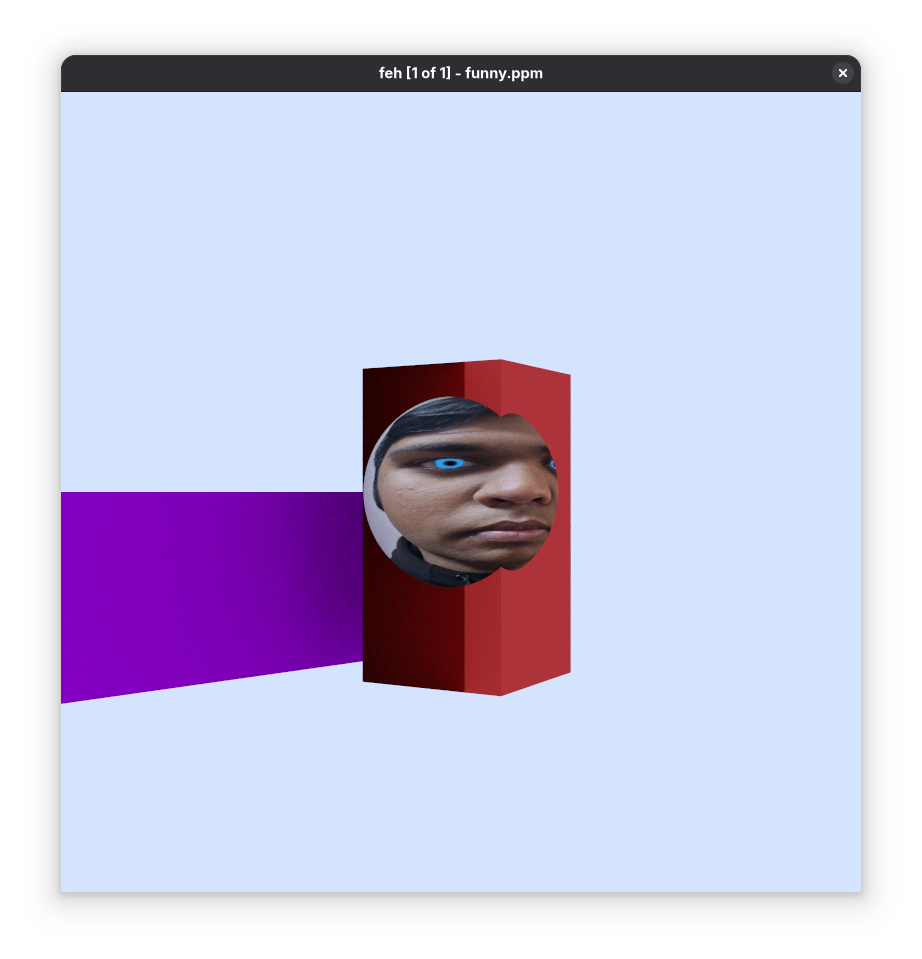
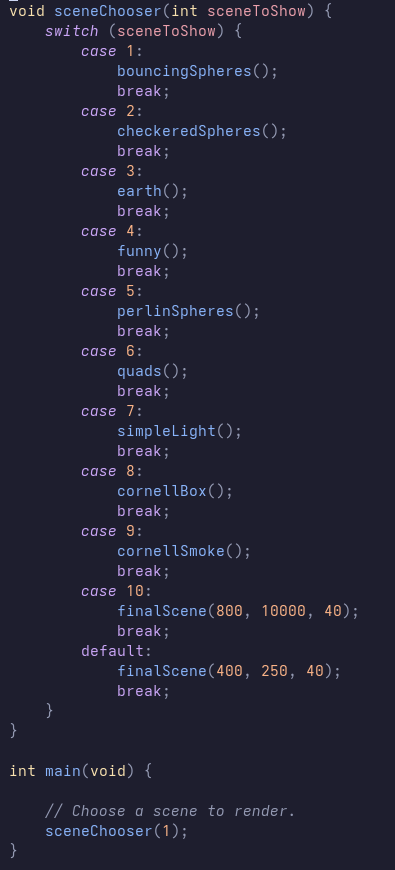

+++
title = "Raytracer"
+++
[GitHub Link](https://github.com/CJSatnarine/Raytracer)

I started working on this raytracer on the 3rd of July, 2024. It was my first graphics programming project, and I learnt quite a bit doing it. To make this raytracer, I followed the books [_Ray Tracing in One Weekend_](https://raytracing.github.io/books/RayTracingInOneWeekend.html) and [_Ray Tracing: The Next Week_](https://raytracing.github.io/books/RayTracingTheNextWeek.html). This was programmed in C++, and for majority of this I was just following through with the code of the books while taking in the important concepts. 

> TLDR: I learnt to use CMake to build the project. I rendered the images to PPM files. I basically followed the code in the books to make the raytracer.

### Some images I made :D 
Here's an happy accident I ran into when I had a typo in my code, I think it looks cool:

Here's my face on a sphere because I thought it was funny at the time: 

###### more images is coming soon LOL

### How the programme works: 
In the `main.cpp` file, there are a bunch of functions that are supposed to render something. I have a switch statement that just assign the different scenes to render. A sort of lazy menu. 

## CMake
It was the first time I used CMake to build a project to run on different platforms. I'm not sure what else to say, it's CMake. It did take me a while to get this stuff working so there's that. 

## PPM Images
This was the first time I had ever came across the [PPM image format (it's somewhere on this Wikipedia article I swear, just go look for it)](https://en.wikipedia.org/wiki/Netpbm). Prior to this I genuinely had no idea how you could send data to files and stuff like that. The PPM is really simple to work with. I'll summarise it by a screenshot of the little rant I sent to my best friend's dms: 

As you can see, very epic balls.
However, I didn't explain what the first 3 lines of the PPM file represented. 

The first line, the `P3`, represents a two-byte magic number. For these files, the magic number works as some sort of identifier to show what type of file we're dealing with. To avoid going on a rant aboutb PPM files, I'm just going to say that the `P3` means that we're dealing with an RGB colour image in ASCII. 

The second line, where it shows two numbers (`400 255`), is the number of columns and rows (respectively) in the image. 

The third line, `255`, tells us the maximum colour. 

Everything after the third line (the group of 3 RGB values) are the RGB values of each individual pixel per line. 

### Writing to PPM Files
I'll also summarise the writing to PPM files bit by another part of the rant directed to my best friend's dms:

The top 3 lines discussed earlier were printed to the console earlier in the code. This was where I learnt how to use the redirectional operators, even though it was already taught in my college classes but I guess I wasn't a good student lol. Any way, that code produced the following image:

## The Raytracer
Okay so the way this works is that a raytracer sends rays through pixels and calculates the colour for each ray sent. The steps are basically: 
1. Calculate the ray from the camera through the pixel. 
2. Determine which objects in the scene the ray intersects. Those objects will be rendered. 
3. Computer a colour for the closest intersection point. 

Building this took a lot of maths, which the book would explain in a much better way than I ever could.What I would be explaining some of the cool topics I learnt while following this book. 

### Camera Stuff
Cameras are, like, important. It's how we see into the scene. :exploding_head: But ya, cameras have aspect ratios. It's basically the ratio of the image width and the image height. For this raytracer, the height of the image is calculated with the image's aspect ratio and the width (`image_height = image_width / (aspect_ratio)`), so you only have to tweak the width when working on resizing the image and also keep the desired aspect ratio. 

Viewports are also pretty important. It's a virtual rectangle in the 3D world that holds the grid of image pixel locations. We need this to pass through all the scene rays. 

A problem here is that the camera centre is at some point in 3D space, and the pixel grid starts from the top left cornr and ends at the bottom right with the last pixel. To get them to work together, the rendering starts from the top left to the top right, and then to the next row im a similar fashion, through the rest of rows until the last pixel. Vectors from the left edge to the right edge, and the upper edge to the lower edge are used to navigate the grid. The pixel grid is also inset from the viewport by half a pixel distance so that the viewport is evenly divided into width and height identical regions. 

###### I'll update the rest of the page when I understand the concepts well enough to explain them. Yeah there's a lot of maths here that I don't have a full grasp of, yet. 
