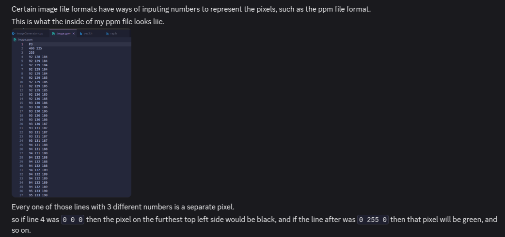
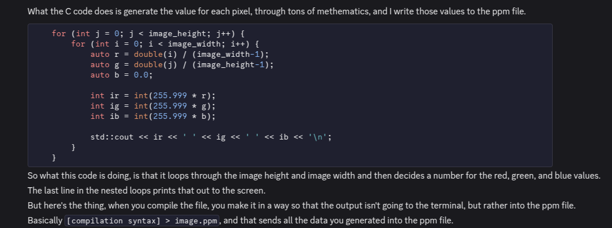
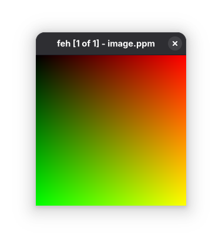
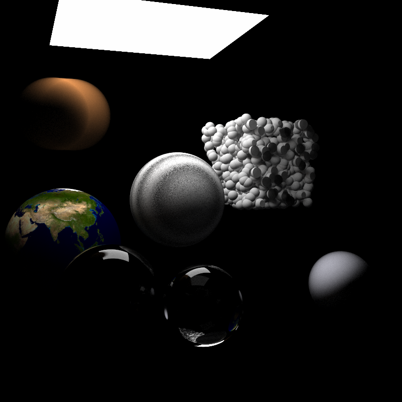

+++
title = "Raytracer"
+++
[GitHub Link](https://github.com/CJSatnarine/Raytracer)

I started working on this raytracer on the 3rd of July, 2024. As of time of writing (19th of May, 2025), that was about 11 months ago. It was my first graphics programming project, and I learnt quite a bit doing it. Do I remember everything from it? Not at all. To make this raytracer, I followed the books [_Ray Tracing in One Weekend_](https://raytracing.github.io/books/RayTracingInOneWeekend.html) and [_Ray Tracing: The Next Week_](https://raytracing.github.io/books/RayTracingTheNextWeek.html). This was programmed in C++, and for majority of this I was just following through with the code of the books while taking in the important concepts. 

I'd like to note that I was (and still am) incredibly bad with maths, so I wouldn't be explaining the maths behind stuff here. Check out the [books](https://raytracing.github.io/) for that. I hope to revisit this project again so I can understand how the maths actually worked. 

> TLDR: I learnt to use CMake to build the project. I rendered the images to PPM files. I basically followed the code in the books to make the raytracer.
## CMake
It was the first time I used CMake to build a project to run on different platforms. I'm not sure what else to say, it's CMake. It did take me a while to get this stuff working so there's that. 

## PPM Images
This was the first time I had ever came across the [PPM image format (it's somewhere on this Wikipedia article I swear, just go look for it)](https://en.wikipedia.org/wiki/Netpbm). Prior to this I genuinely had no idea how you could send data to files and stuff like that. The PPM is really simple to work with. I'll summarise it by a screenshot of the little rant I sent to my best friend's dms: 

As you can see, very epic balls.
However, I didn't explain what the first 3 lines of the PPM file represented. 

The first line, the `P3`, represents a two-byte magic number. For these files, the magic number works as some sort of identifier to show what type of file we're dealing with. To avoid going on a rant aboutb PPM files, I'm just going to say that the `P3` means that we're dealing with an RGB colour image in ASCII. 

The second line, where it shows two numbers (`400 255`), is the number of columns and rows (respectively) in the image. 

The third line, `255`, tells us the maximum colour. 

Everything after the third line (the group of 3 RGB values) are the RGB values of each individual pixel per line. 

### Writing to PPM Files
I'll also summarise the writing to PPM files bit by another part of the rant directed to my best friend's dms:

The top 3 lines discussed earlier were printed to the console earlier in the code. This was where I learnt how to use the redirectional operators, even though it was already taught in my college classes but I guess I wasn't a good student lol. Any way, that code produced the following image:

## The Raytracer
I'll be honest, I'm this writing project page thingy after nearly a year since I worked on this project. There was a lot covered, and I was introduced to a lot of new concepts, but I'm not confident with how much I actually recall from the raytracer itself.
### How it works
So basically what you do is shoot a bunch of rays from the camera to points (or every pixel for the raytracer) and determine which objects the ray intersect, calculating the colour for the point closest to the camera.  
### Okay what about the other stuff??
What I remember from the project is all a blur. I have an idea of how antialiasing works, but I can't really explain with great detail why it works, and I don't ~recall~ know enough to explain how the maths behind it. That's the case for a lot of the other stuff here. 

## Final Words
The purpose of this project was to learn how raytracing worked. I did that, but not exactly, as I now have a sort of idea of how it works but not a full understanding. As my first graphics programming project, I think I did okay trying to understand raytracing, even though I can't recall much of it. This project sort of gave me an idea of how complicated graphics was, and I unintentially learnt more about CMake, PPM files, and some C++ stuff than the maths behind raytracing lol. 

Any way, here's a happy accident I ran into when I was trying to render the final render from the book, I think it looks cool:

I hope to redo this project and actually learn more stuff, perhaps in OpenGL. 
