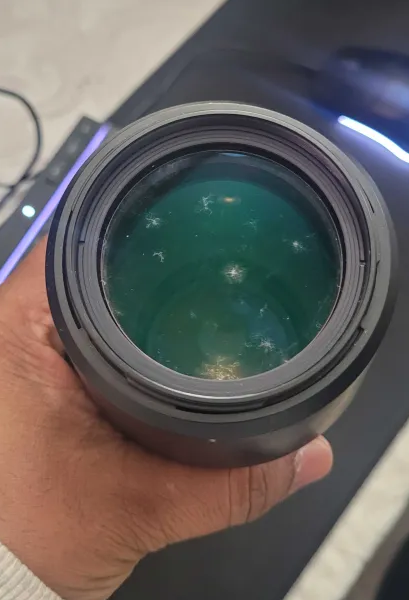
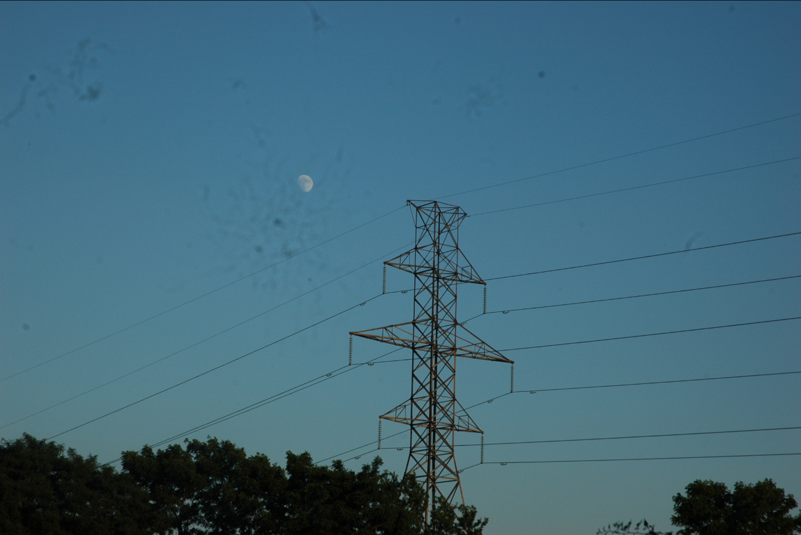
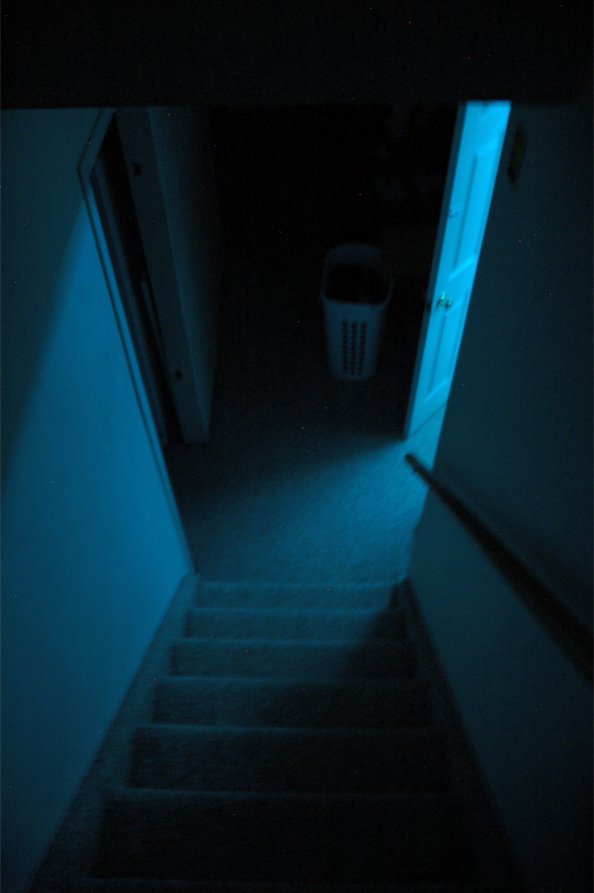

+++
title = "Nikon D70s"
+++
Some time in the July of 2025, I managed to get my hands on a Nikon D70s DSLR that was sitting around for years. I got it with a `Nikon NIKKOR 70-300mm f/4.0-5.6 D AF ED Lens` and a `Nikon DX SWM ED IF Aspherical 67 AF-S Nikkor 18-70mm 1:3.5-4.5G ED`. Honestly, I don't know what any of this means, but with time I'll learn. I was hoping to learn photography with this camera, however, we have a problem:

It seems that though the nearly one decade of the camera sitting around has allowed a colony of fungi to reside in both lenses. Even though I have computer refurbishing experience, I am genuinely too afraid to open up the lenses because I'm not confident I would be able to put them together.The above image is from the `70-300mm` lens, which looks pretty bad. The other lens, the `18-70mm`, isn't as *bad*, but  the fungi is still pretty visible: 

I'm going to have to fix this eventually. Somehow. Anyway, here's one of the first pictures I took with the camera:

